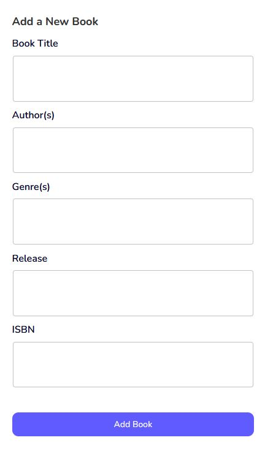
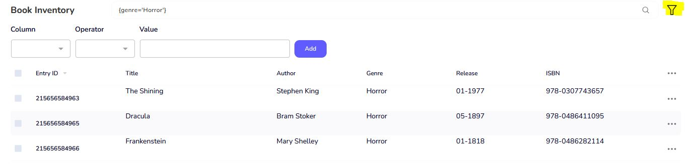
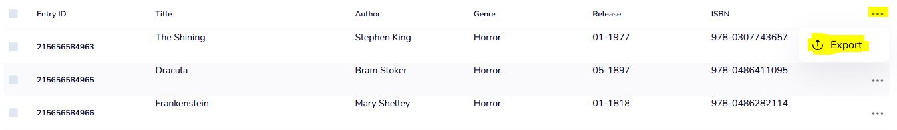

# Inventory Management System for Books

A simple React application for the front-end and an Express app with SQLite for the back-end.

## Features 

- Display book inventory in a table
- Filter inventory based on columns: Title, Author, Genre, Release Date, and ISBN
- Add new books via a form
- Export books as JSON based on queries

## Technologies

- React
- TypeScript
- SQLite
- Express

## Prerequisites

- Node.js
- Tested on Windows 10 and Firefox browser

## Set Up

1. Clone the repository:  
   `git clone git@github.com:lectorguard/BookIMS.git`  
   or  
   `git clone https://github.com/lectorguard/BookIMS.git`
   
2. Inside the `BookIMS` folder, run:  
   `npm install`

3. Run the following command to start both the client and server applications together:  
   `npm run start`

   - Alternatively, you can run the client and server separately:  
     - `npm run dev` (for the client)  
     - `npm run api` (for the server)

4. The web app runs in the browser at:  
   `http://localhost:3000/base`

## Usage

### Add a Book to the Inventory

- Fill in the form on the right side of the screen.
- Clicking **Add Book** triggers validation.
- On success, a success message is displayed under the form.

### Books List

- Books are displayed in the main table based on the local search and database filters.

### Database Search

1. Click on the filter icon next to the search bar (highlighted in yellow).
2. Fill in the form based on the column, operator, and search value.
3. By clicking **Add**, the filter is added to the search bar as a database filter.
4. You can add multiple filters by filling out the form multiple times or by manually writing the filter in the format `{<column><operator><value>}`.
5. The book table automatically updates to show the filtered results.

### Local Search

- After performing a database search, you can further search using keywords. Simply type the keywords after the database query, like:  
  `{genre='Horror'} Dracula`

### Export Data

- You can export the current search result or a single book by clicking on the three dots in the table header or next to a book entry (highlighted in yellow).
- When you click **Export**, a JSON file containing the selected books will be downloaded.

### Demo

[View Demo](https://github.com/user-attachments/assets/a8af42f0-b516-4235-8e0b-8e39a19f748c)

## Relevant Code

- The relevant code for this project is located in the following two folders:
  - `src/components/sections/dashboard/`
  - `src/components/database/`

- The database (`books.db`) is created automatically when running the project in the root directory.

## Design Decisions

- The design is based on a theme from [ThemeWagon](https://themewagon.com/), which provides out-of-the-box responsiveness and modern UI components.
- All design adaptations were derived from this theme.

## Challenges

- The biggest challenge was converting the database book format to a stricter client-side book format:
  - Handling different date formats
  - Converting ISBN formats
- Validating inputs in the **Add Book** form
- Performing internal validation of database queries
